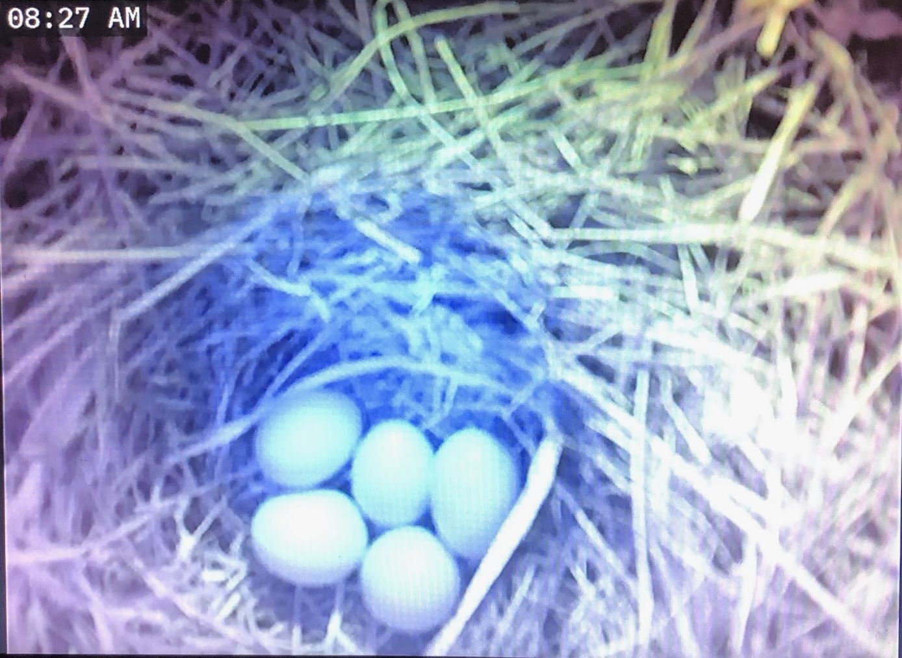
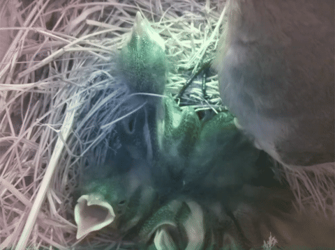
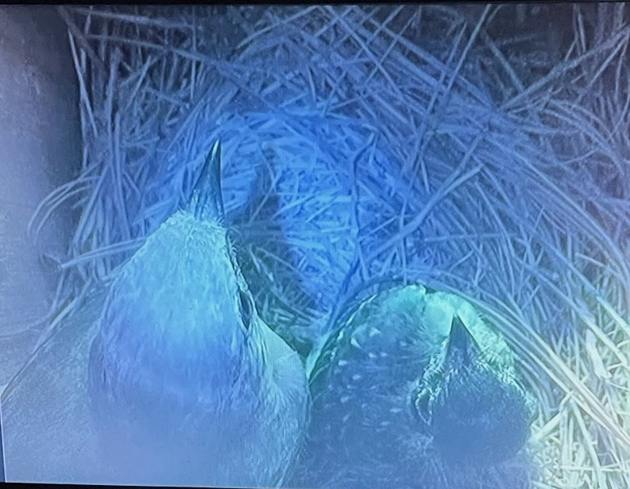
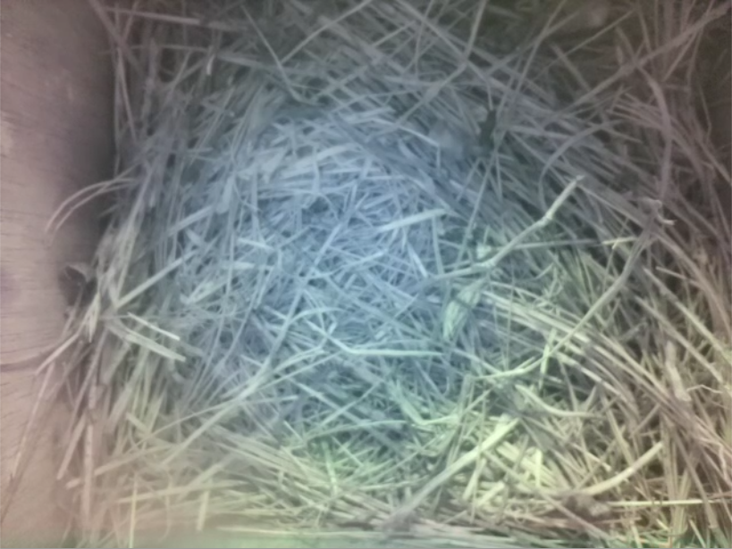

# BirdCam 
A birdhouse camera livestream with motion detection and mobile push notifications.

## Installing Pushover

1. Download the [Pushover App](https://apps.apple.com/us/app/pushover-notifications/id506088175?ls=1) from the app store.
2. Log in using my credentials
3.  Name your device, i.e. *henry-phone*
4. Await the notifications!

## Lightweight Motion Detection

In order to comply with the weak compute power of the raspberry pi, the motion detection is triggered by a simple subtraction of consecutive frames as shown below. The mean difference in pixels triggers the motion threshold.

## RTSP Stream with MediaMTX
As of 6/6 the streaming service has been transferred from flask deployment to a local RTSP stream. This is done using [MediaMTX](https://github.com/bluenviron/mediamtx). Similar to the flask deployment, this allows for viewing using VLC and HTTP (web browser).

This decision was made as the motion detection has served its purpose in the early stages of birdcam activity. With a full family now in the house, there is less need for detection and an emphasis on consistent low-latency streaming, which MediaMTX provides.

## RTSP Stream with VLC

6/25 - Replaced MediaMTX service with libcamera + VLC implementaion. See [stream.sh](https://github.com/henrynoyes/birdcam/blob/master/stream.sh) for RTSP streaming command.

## Update 5/24

The birdcam has its first visitor. Caught perfectly by the motion detection :D

## Update 5/27

Sneak peek of nest construction

## Update 6/6

Eggcellent news, we are housing a bluebird family

## Update 6/18

The babies have escaped their eggs

## Update 6/20

More baby action + mini afros

## Update 6/25

They are growing up fast and attempting to open their eyes

## Update 7/1

Full family of feathers

## Update 7/5 

4 of the babies have officially left the nest! Only a single runt remains with mama...

 

## Update 7/6

Success!! All the fledglings are flying out in the backyard

 

Until the next family arrives...