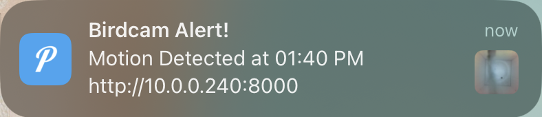
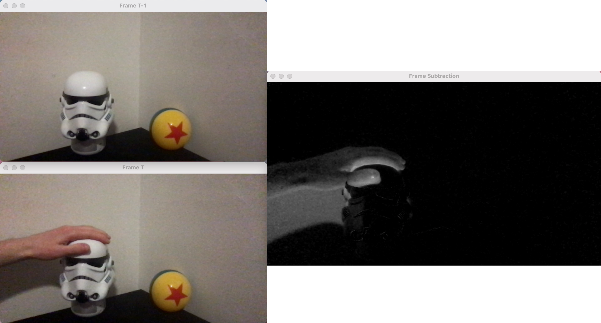
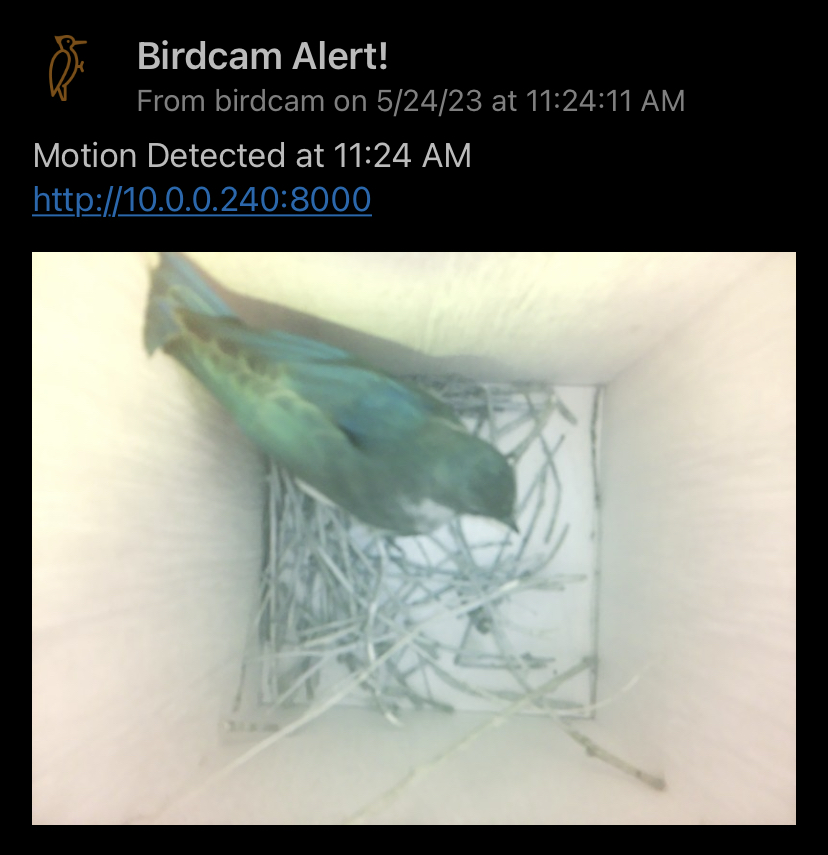
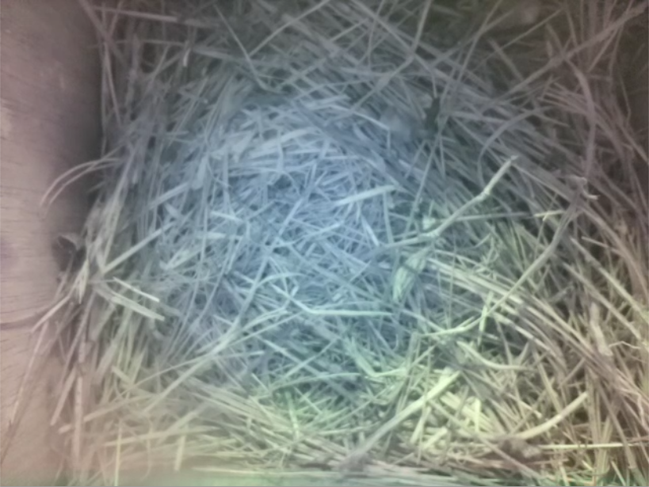

# BirdCam 
A birdhouse camera livestream with motion detection and mobile push notifications.

## Installing Pushover

1. Download the [Pushover App](https://apps.apple.com/us/app/pushover-notifications/id506088175?ls=1) from the app store.
2. Log in using my credentials
3.  Name your device, i.e. *henry-phone*
4. Await the notifications!

## Lightweight Motion Detection

In order to comply with the weak compute power of the raspberry pi, the motion detection is triggered by a simple subtraction of consecutive frames as shown below. The mean difference in pixels triggers the motion threshold.

## RTSP Stream with MediaMTX
As of 6/6/23 the streaming service has been transferred from flask deployment to a local RTSP stream. This is done using [MediaMTX](https://github.com/bluenviron/mediamtx). Similar to the flask deployment, this allows for viewing using VLC and HTTP (web browser).

This decision was made as the motion detection has served its purpose in the early stages of birdcam activity. With a full family now in the house, there is less need for detection and an emphasis on consistent low-latency streaming, which MediaMTX provides.

## RTSP Stream with VLC

6/25/23 - Replaced MediaMTX service with libcamera + VLC implementaion. See [stream_local.sh](https://github.com/henrynoyes/birdcam/blob/master/stream_local.sh) for RTSP streaming command.

## RTMP Stream with YouTube

5/1/25 - Since I'll be away from home this summer, I've added a libcamera + ffmpeg implementation to livestream to YouTube. See [stream_youtube.sh](https://github.com/henrynoyes/birdcam/blob/master/stream_youtube.sh)

<h2 id="chapter-1">Chapter 1: The Bluebirds</h2>

## Update 5/24/23

The birdcam has its first visitor. Caught perfectly by the motion detection :D

## Update 5/27

Sneak peek of nest construction

## Update 6/6

Eggcellent news, we are housing a [bluebird](https://www.allaboutbirds.org/guide/Eastern_Bluebird/overview) family

## Update 6/18

The babies have escaped their eggs

## Update 6/20

More baby action + mini afros

## Update 6/25

They are growing up fast and attempting to open their eyes

## Update 7/1

Full family of feathers

## Update 7/5

4 of the babies have officially left the nest! Only a single runt remains with mama...

 

## Update 7/6

Success!! All the fledglings are flying out in the backyard

 

Until the next family arrives...

<h2 id="chapter-2">Chapter 2: The Wrens</h2>

## Update 7/19/23

The bluebird nest was cleared out and a female [carolina wren](https://www.allaboutbirds.org/guide/Carolina_Wren/overview) is our newest inhabitant. The four eggs were laid a few days ago and will take another week or so to hatch.

## Update 8/10

Some shots of the three baby wrens. Unfortunately one of the eggs did not hatch. The trio is fledging quickly!

<h2 id="chapter-3">Chapter 3: The Lone Woodpecker</h2>

## Update 8/23/24

It's been an uneventful summer for the birdcam, to say the least. Early June saw a potential bluebird nesting thwarted by a violent sparrow, and July was entirely devoid of activity. Finally, a couple weeks ago, we secured our first inhabitant of the summer: a [downy woodpecker](https://www.allaboutbirds.org/guide/Downy_Woodpecker/overview). They have adopted the birdcam as a roosting box. They dwell from dawn to dusk and often spend time cleaning their feathers before dozing off.

<h2 id="chapter-4">Chapter 4: Return of the Bluebirds</h2>

## Update 4/22/25

It did not take long for avian action to begin in 2025. Just after installing the birdcam for the third season, a pair of bluebirds were spotted scouting the historied property. Much like the [inaugural inhabitants from 2023](#chapter-1), these guys are [eastern bluebirds](https://www.allaboutbirds.org/guide/Eastern_Bluebird/overview). The parents are currently locked in on nest construction, preparing for an eventful start to the summer.

