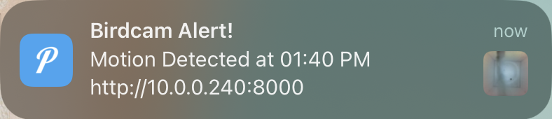
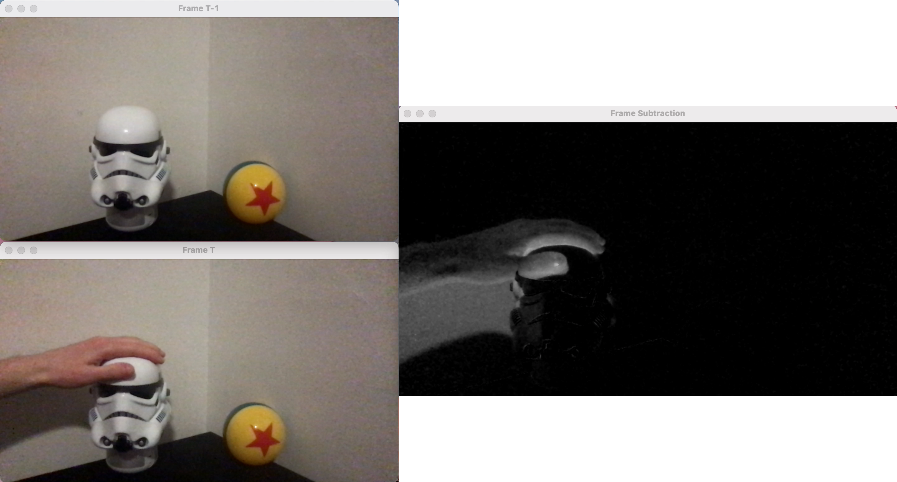
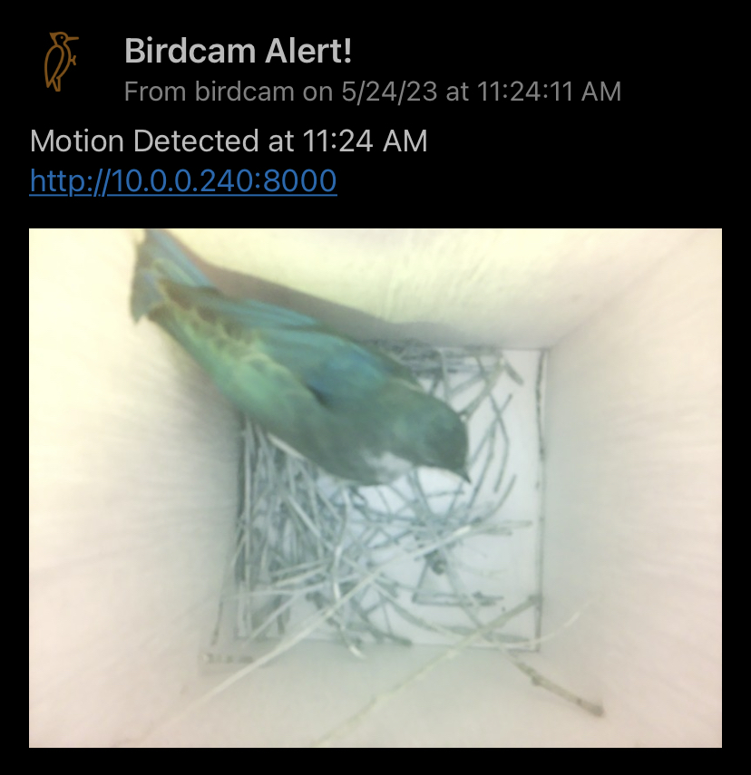

# BirdCam 
A birdhouse camera livestream with motion detection and mobile push notifications. 

## Installing Pushover

1. Download the [Pushover App](https://apps.apple.com/us/app/pushover-notifications/id506088175?ls=1) from the app store.
2. Log in using my credentials
3.  Name your device, i.e. *henry-phone*
4. Await the notifications!

## Lightweight Motion Detection

In order to comply with the weak compute power of the raspberry pi, the motion detection is triggered by a simple subtraction of consecutive frames as shown below. The mean difference in pixels triggers the motion threshold.

## Update 5/24

The birdcam has its first visitor. Caught perfectly by the motion detection :D

